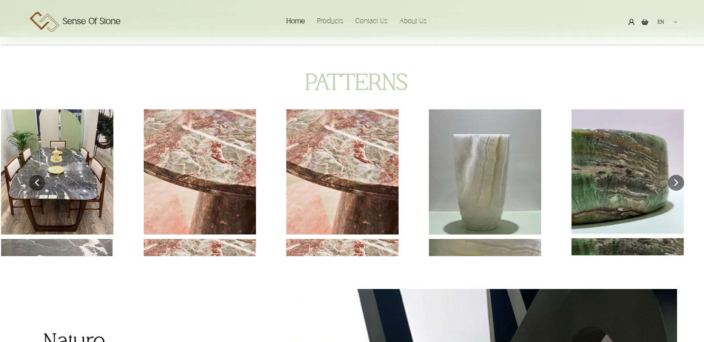
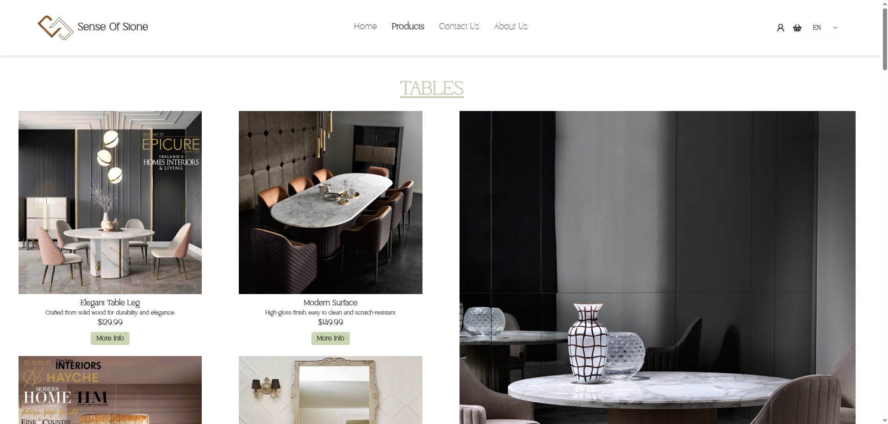
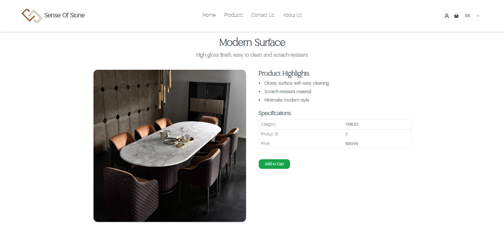
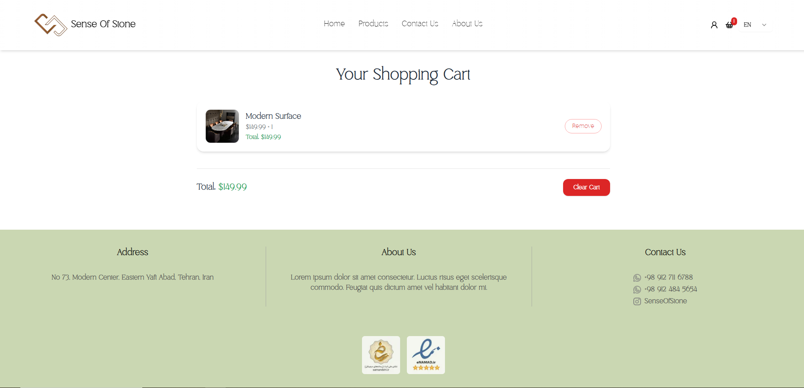
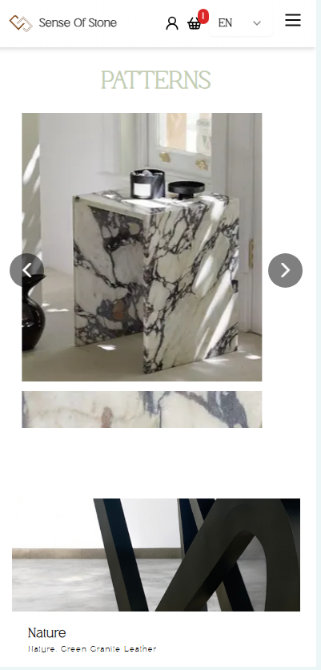
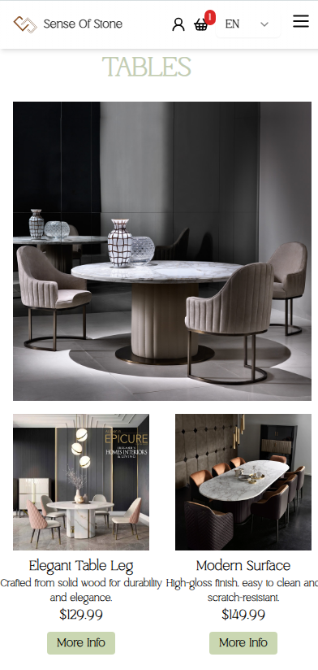
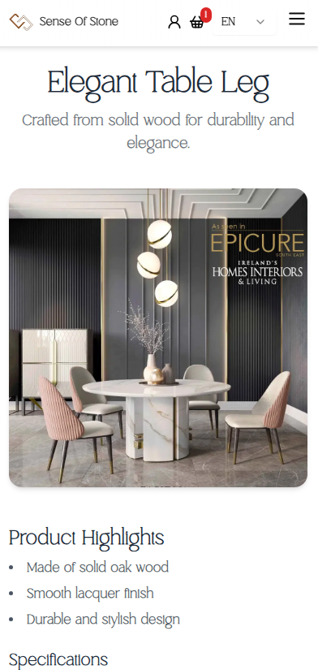
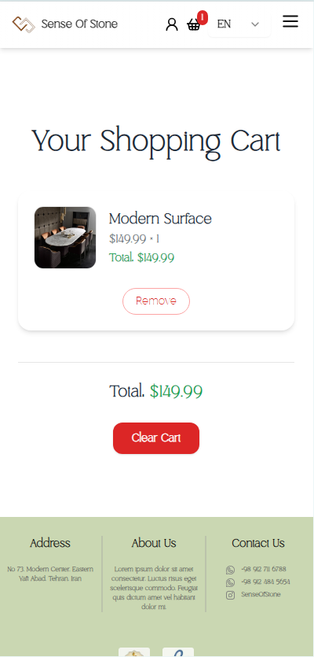

# 🪨 Sense of Stone - Product Showroom Website (in development)

A modern, multi-language product showroom website built with [Next.js](https://nextjs.org/), focused on performance, SEO, and user experience.

🔗 **Live Preview**: [https://developing-sos-nipj.vercel.app/en](https://developing-sos-nipj.vercel.app/en)

## ✨ Features

- ⚙️ **Next.js with Server-Side Rendering (SSR)**  
  Built using Next.js to optimize page load time and SEO performance.

- 🌍 **Multi-language Support (i18n)**  
  Fully localized content in both **English** and **Persian**.

- 🛒 **Shopping Cart with Redux**  
  A functional and extendable shopping cart system using Redux for global state management.

- 🧭 **Category-Based Filtering**  
  Browse products by category with dynamic filtering options for an improved user experience.

- 📱 **Responsive & Mobile-First Design**  
  Optimized for all devices with smooth navigation and a clean, modern layout.

- 🔍 **SEO-Friendly**  
  Structured pages with server-rendered content and localized metadata for better search visibility.

## 🛠️ Technologies Used

- [Next.js](https://nextjs.org/)
- [Redux Toolkit](https://redux-toolkit.js.org/)
- [react-i18next](https://react.i18next.com/)
- [Vercel](https://vercel.com/) for deployment

## 📦 Installation & Setup

```bash
# Clone the repository
git clone https://github.com/your-username/sense-of-stone.git
cd sense-of-stone

# Install dependencies
npm install

# Run the development server
npm run dev

# Visit http://localhost:3000 to view the app
```

## 🌐 Localization
Supports the following languages:

🇬🇧 English

🇮🇷 فارسی (Persian)

## 🚧 Status
This project is currently in active development.
New features, optimizations, and UI improvements are being added regularly.


## 🖼️ Screenshots

> A preview of the current landing page:

*Desktop view*









*Mobile view*








